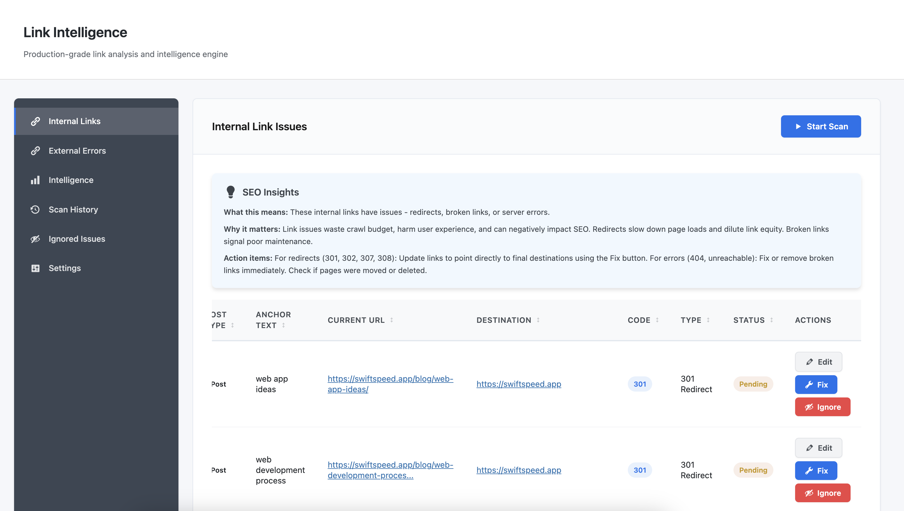
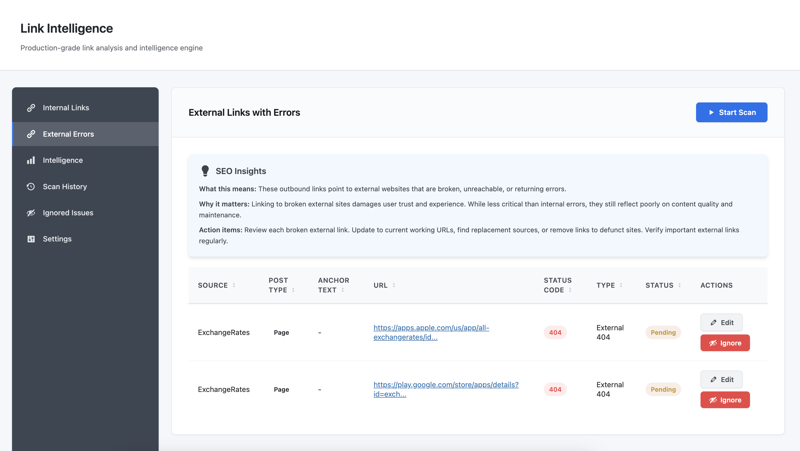
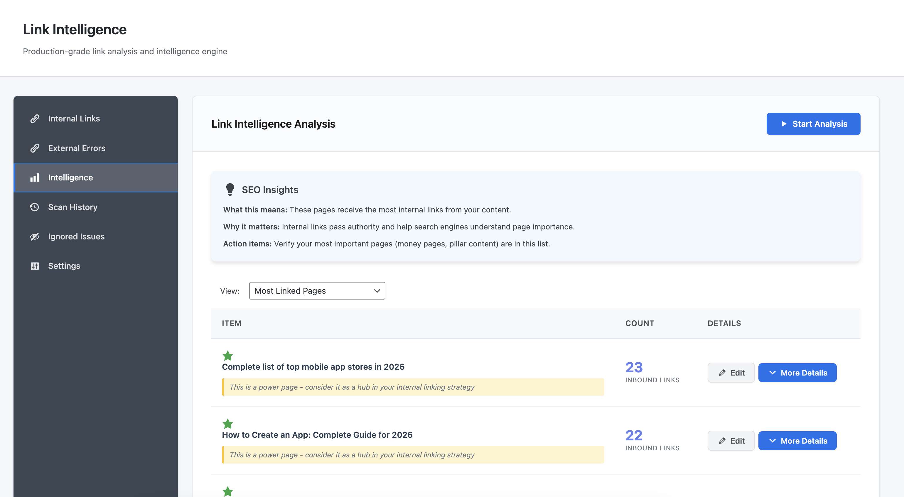
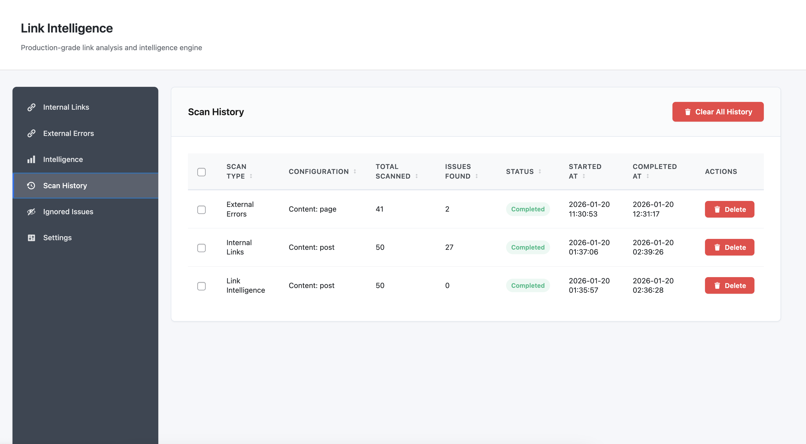

# Link Health

**Version:** 1.0.0  
**Requires:** WordPress 5.6+, PHP 7.4+  
**License:** GPL v2 or later

Production-grade link analysis and intelligence engine for WordPress. Monitor internal and external link health, detect broken links and redirects, and gain editorial link intelligence without automatic content modifications.

---

## Overview

Link Health is a comprehensive link monitoring and analysis tool built for editorial teams, SEO professionals, and site maintainers who need complete visibility into a WordPress site’s link structure.

Unlike automated link fixers, this plugin focuses on detection, reporting, and editorial decision-making rather than automatic content changes.

The plugin scans WordPress content to identify three categories of information:

1. **Internal Link Health**  
   Redirects, broken links, and server errors on internal URLs.

2. **External Link Errors**  
   Broken and unreachable outbound destinations.

3. **Link Intelligence**  
   Linking patterns, anchor text usage, and external domain relationships.

All fixes require explicit administrator action. No content is modified automatically.

---

## Why Link Health Matters

Links degrade over time. Internal restructuring introduces redirect chains. External websites move, change ownership, or shut down. Content evolves, but link references often remain static.

These issues compound into measurable problems:

- Redirect chains increase page load time and dilute link equity
- Broken internal links waste crawl budget and harm user experience
- Broken external links signal poor content maintenance
- Inefficient internal linking leaves valuable content orphaned
- Over-linking to specific domains may trigger spam filters

Link Health addresses these problems through controlled auditing and review workflows rather than automated replacements.

---

## Internal Link Health

The Internal Links scanner examines all links within your site and reports:

### Redirect Detection

- HTTP 301 (Moved Permanently)
- HTTP 302 (Found / Temporary Redirect)
- HTTP 307 (Temporary Redirect)
- HTTP 308 (Permanent Redirect)

For each redirect, the plugin shows the current link, the final destination, and the redirect chain.

### Error Detection

- HTTP 404 (Not Found)
- HTTP 410 (Gone)
- HTTP 5xx (Server Errors)

Each issue includes the source post, anchor text, URL, and HTTP status code.

### Issue Details

For every detected issue, Link Health displays:

- Source post title and type
- Anchor text used in the link
- Current URL
- Destination URL (for redirects)
- HTTP status code
- Issue classification
- Fix status (Pending, Fixed, Ignored)

Administrators can edit the source post, apply a URL replacement, or ignore the issue.

---

## External Link Errors

The External Links scanner validates outbound links to third-party domains.

### Error Types

- HTTP 404 (Not Found)
- HTTP 410 (Gone)
- HTTP 5xx (Server Errors)
- DNS failures and timeouts

### Detection Strategy

External URL validation uses the WordPress HTTP API with transient caching. URLs are checked once per scan to reduce unnecessary external requests.

The plugin does not automatically replace external URLs. Editorial review is required.

---

## Link Intelligence Analysis

Beyond error detection, Link Health provides insight into how content is interconnected.

### Most Linked Internal Pages

Identifies pages receiving the highest number of inbound internal links. This helps to:

- Discover pillar or hub content
- Identify over-linked or under-linked pages
- Improve internal linking balance

Results include inbound link counts and expandable details showing source posts and anchor text usage.

---

### External Domains

Groups outbound links by destination domain to reveal:

- Frequently cited external sources
- Over-reliance on specific domains
- Citation and reference patterns

Detailed views show which posts link to each domain and the anchor texts used.

---

### Anchor Text Patterns

Analyzes anchor text usage across the site to identify:

- Repeated exact-match anchors
- Generic versus descriptive anchors
- Opportunities for more natural phrasing

This supports editorial consistency and content quality.

---

## Scan Engine Design

Scans are explicitly initiated by administrators and run entirely within the WordPress admin environment.

### Scan Process

1. Administrator initiates a scan
2. Published content is queried directly from the database
3. Links are extracted from `post_content`
4. URLs are resolved using the WordPress HTTP API
5. Results are stored incrementally in custom tables
6. Scan progress is persisted and resumable

There is no frontend crawling and no background content mutation.

### Performance Characteristics

- One URL processed per execution cycle
- No long-running PHP processes
- Pagination for large datasets
- Caching to reduce redundant HTTP requests

Large sites may require longer scan times, but scans remain safe and transparent.

---

## Performance and Safety

### Frontend Performance

- No frontend JavaScript or CSS
- No public-facing routes
- Admin-only execution with capability checks

### Database Design

- Custom tables for scan data
- Indexed columns for efficient queries
- Optional cleanup on uninstall

### Security

- Nonce verification for all AJAX requests
- Capability checks on all admin actions
- Prepared statements for database queries
- Escaped output for all rendered data

### Compatibility

- Works with posts, pages, and custom post types
- Compatible with Gutenberg and Classic Editor
- No conflicts with caching plugins

## Screenshots

### Internal Link Issues

The Internal Links view displays detected redirects and errors in a sortable table. Each row shows the source post, anchor text, current URL, destination (for redirects), HTTP status code, and action buttons.

---

### External Link Errors

External Errors view lists broken outbound links with source post information, anchor text, broken URL, and HTTP status code.

---

### Link Intelligence Analysis

The Intelligence view shows most-linked internal pages ranked by inbound link count, with expandable details.

---

### External Domains

External Domains intelligence reveals which external websites receive the most outbound links from your content.

---

### Scan History

Scan History tracks completed scans, configurations, and results over time.

## Data Handling and Privacy

**Data Storage**

All scan results, link issues, and intelligence data are stored in custom WordPress database tables prefixed with `wp_li_`. The plugin creates the following tables:

* `wp_li_settings`: Plugin configuration
* `wp_li_scans`: Scan history records
* `wp_li_issues`: Detected link problems
* `wp_li_ignored`: Manually ignored issues
* `wp_li_fixes`: Applied fix history
* `wp_li_intelligence`: Link pattern analysis
* `wp_li_scan_state`: Active scan state tracking

**Data Retention**

By default, all plugin data persists after uninstall. If you want automatic cleanup, enable the "Delete on Uninstall" option in Settings before uninstalling the plugin.

**External Requests**

Link Health makes HTTP requests only to URLs found in your own content during scans. No data is sent to external services or third-party APIs. All scanning happens server-side within your WordPress installation.

**Privacy Compliance**

The plugin stores only:

* URLs found in your content
* HTTP response codes from URL validation
* Anchor text from your posts
* WordPress post IDs and titles

No personally identifiable information is collected, stored, or transmitted. No cookies are set. No frontend tracking occurs.

## Installation and Configuration

1. Upload the `link-health` directory to `/wp-content/plugins/`
2. Activate through the WordPress Plugins menu
3. Navigate to Link Health in the admin sidebar
4. Configure Settings:
   * Select which post types to include in scans
   * Set data retention preferences
5. Start your first scan from any tab

## Technical Requirements

* WordPress 5.6 or higher
* PHP 7.4 or higher
* MySQL 5.6 or higher / MariaDB 10.1 or higher
* Administrator account for plugin access

## Credits

**Developed by:** [Àgbà Akin](https://akinolaakeem.com)  
**Managed by:** [Ssu-Technology Limited](https://swiftspeed.org)  
**Supported by:** [Swiftspeed](https://swiftspeed.app)

## License

Link Health is free software released under the GNU General Public License v2.0 or later. See LICENSE file for details.
